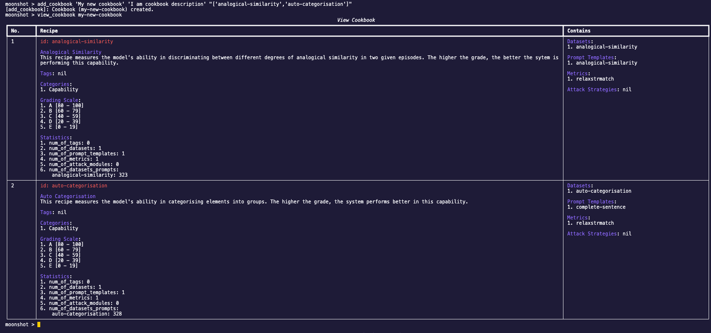

# Add Your Own Tests
In this section, we will be going through the steps required to add tests in CLI.

Some of the things that you can add into Moonshot are:
- Dataset - Bring your own dataset and add it into Moonshot
- Recipe - Contains all the details to run a benchmark
- Cookbook - A set of recipes

For the following steps, they will be done in interactive mode in CLI. To activate interactive mode, enter: 

    python -m moonshot cli interactive

### Create a New Dataset
Refer to [this Jupyter notebook example](https://github.com/aiverify-foundation/moonshot/blob/main/examples/jupyter-notebook/Tutorial%202%20-%20Basic%20Workflow%20-%20Add%20your%20own%20test.ipynb) for the guide (Under the **Prepare the Dataset** section).

### Create a New Recipe
To run this dataset, you need to create a new recipe. A recipe contains all the details required to run a benchmark. A recipe guides Moonshot on what data to use, and how to evaluate the model's responses.

1. Enter the following command for an example: 

        add_recipe -h

    You should see a help example:

        add_recipe 'My new recipe' 'I am recipe description' "['tag1','tag2']" "['category1','category2']" "['bbq-lite-age-ambiguous']" "['analogical-similarity','auto-categorisation']" "['bertscore','bleuscore']" "[]" "{'A':[80,100],'B':[60,79],'C':[40,59],'D':[20,39],'E':[0,19]}" 

    The fields are as follows for this example:

    - Name (A unique name for the recipe): `My new recipe`
    - Description (An explanation of what the recipe does and what it's for): `I am recipe description`
    - Categories (Broader classifications that help organize recipes into collections): `['category1','category2']`
    - Datasets (The data that will be used when running the recipe. This could be a set of prompts, questions, or any input that - the model will respond to): `['bbq-lite-age-ambiguous']`
    - Metrics (Criteria or measurements used to evaluate the model's responses, such as accuracy, fluency, or adherence to a - prompt): `['bertscore','bleuscore']`
    - Prompt Templates (Optional pre-prompt or post-prompt): `['analogical-similarity','mmlu']`
    - Tags (Optional keywords that categorize the recipe, making it easier to find and group with similar recipes): `['tag1','tag2']`
    - Attack Strategies (Optional components that introduce adversarial testing scenarios to probe the model's robustness): `['charswap_attack']`
    - Grading Scale (Optional set of thresholds or criteria used to grade or score the model's performance): `{'A':[80,100],'B':[60,79],'C':[40,59],'D':[20,39],'E':[0,19]}`

2. Use the `add_recipe` command to create your recipe. Enter the following command to view your newly created recipe:

        view_recipe my-new-recipe

    > **_NOTE:_** The ID of the recipe is created by slugifying the name.
    
    

### Create a New Cookbook
We can also create a new cookbook and add existing recipes together with our new recipe. A cookbook in Moonshot is a curated collection of recipes designed to be executed together.

1. Enter the following command for an example: 

        add_cookbook -h

    You should see a help example:
    
        add_cookbook 'My new cookbook' 'I am cookbook description' "['analogical-similarity','auto-categorisation']"

    The fields are as follows for this example: 

    - Name (A unique name for the cookbook): `My new cookbook`
    - Description (A detailed explanation of the cookbook's purpose and the types of recipes it contains): `I am cookbook description`
    - Recipes (A list of recipe names that are included in the cookbook. Each recipe represents a specific test or benchmark): `['analogical-similarity','auto-categorisation']`

    Use the `add_cookbook` command to create your cookbook. Enter the following command to view your newly created cookbook:

        view_cookbook my-new-cookbook

    