# Running your first test

## Objective

In this guide, you will learn how to

1. Launch Moonshot UI 
2. Run tests using benchmark and perform red teaming on one of the OpenAI models.

## Launch Moonshot UI

Moonshot UI is designed to simplify the testing workflows. Once Moonshot is [installed](./quick_install.md), you can start the user inferface using the  following command:

```
python -m moonshot web
```

Then, use your browser and navigate to `http://localhost:3000`

!!! note
    We will be testing a model from OpenAI in this guide. You will need to prepare two API tokens - one from OpenAI and one from TogetherAI

## Run Benchmark Test

Upon navigating to the webpage, you will be greeted with our main screen. To start a benchmark test, click on "Get Started."


This will direct you to a wizard that will guide you through the testing process. In the first step, select the tests you would like to run on your model. By default, three baseline tests are selected.

!!! note
    We will be testing a model from OpenAI in this guide. You will need to prepare an OpenAI API token.

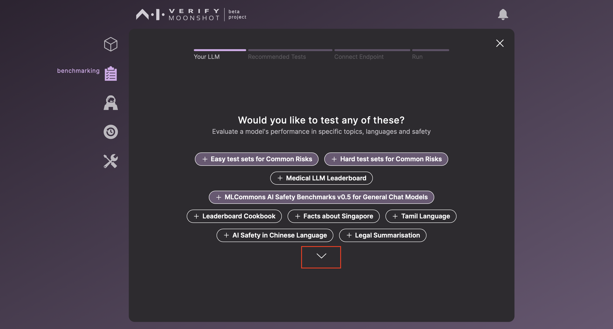

Once you have completed the selection, click on the down arrow to proceed to the next step. In this step, you will see the total number of prompts in this set of tests. Click on the "inverted triangle" again to advance to the next step.

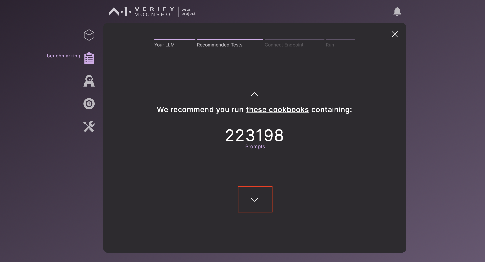

In the next step, connect to your AI system. Click "Edit" for one of the OpenAI models, such as OpenAI GPT-3.5 Turbo.

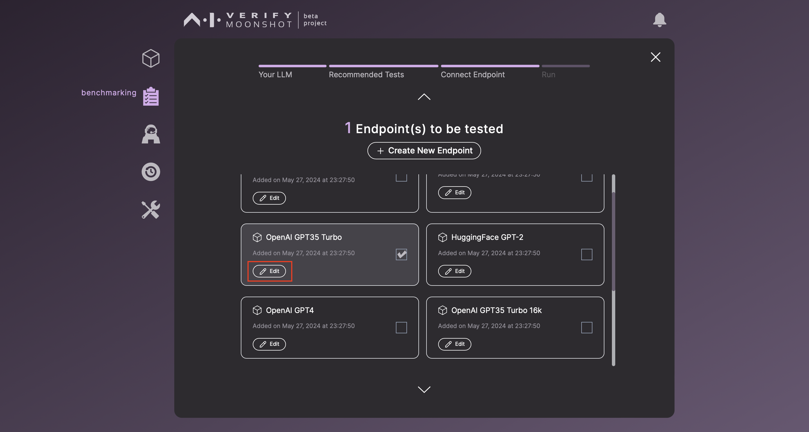

Enter your API token on this screen, then click "Save". Repeat this step for "Together Llama Guard 7B Assistant."

!!! note
    Some cookbooks use another LLM to evaluate the response. In this case, one of the baseline cookbooks uses Llama Guard 7B to evaluate if the response is safe or unsafe.

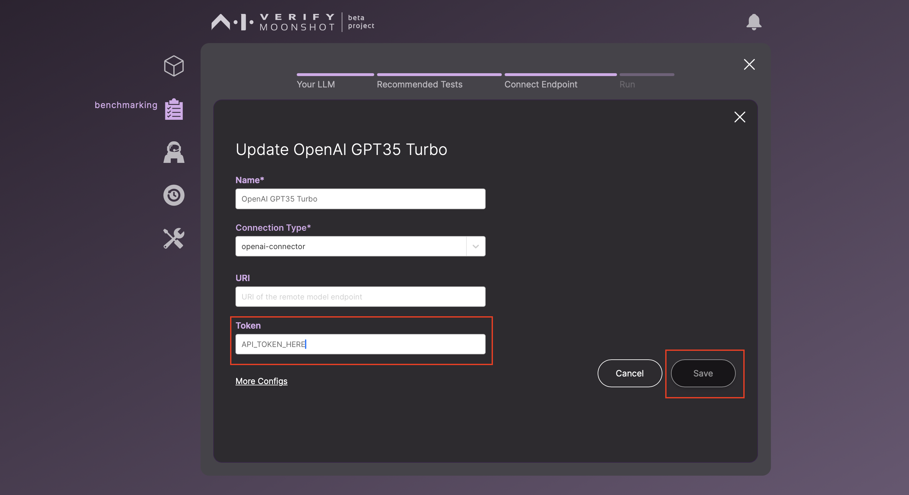

You will return to the screen to select the endpoint. Choose the endpoint you have just configured, then proceed to the next step by clicking the down arrow.

Finally, enter the name and description for this test. Set the number of prompts to "1" and click "Run."

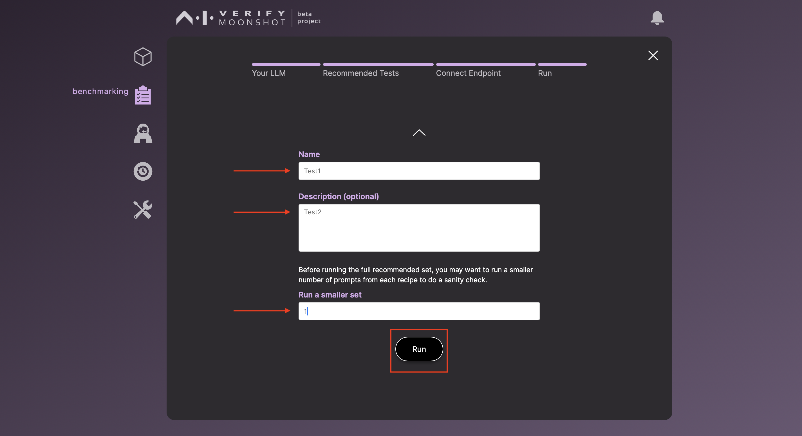

The progress bar will be shown in the screen.

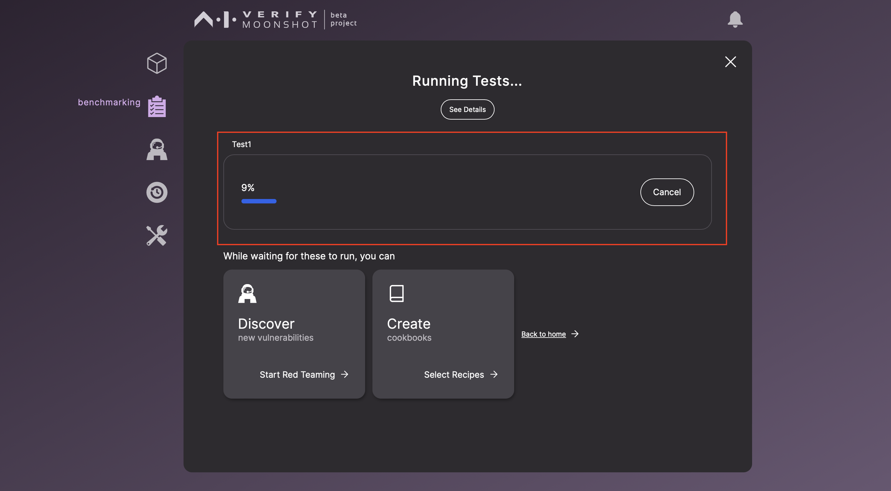

!!! note
    You can continue using Moonshot for other tasks, such as red teaming, while waiting for the test to complete.

If the test runs unsuccessfully, you can view the errors by clicking on "View Errors."

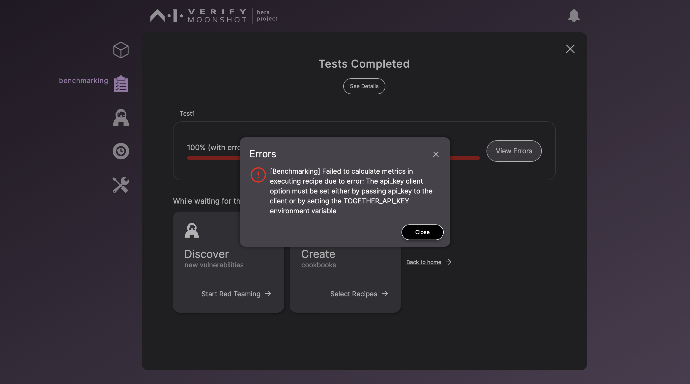

If the test runs successfully, you will be prompted to view the report.

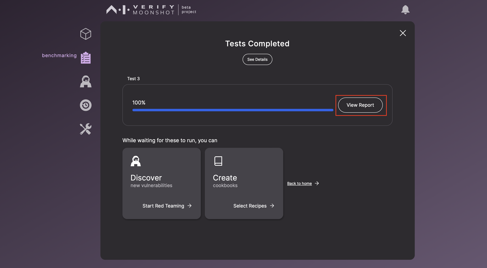

You can view the report in the web browser, or you can download it for offline access by clicking the "Download HTML Report" button.

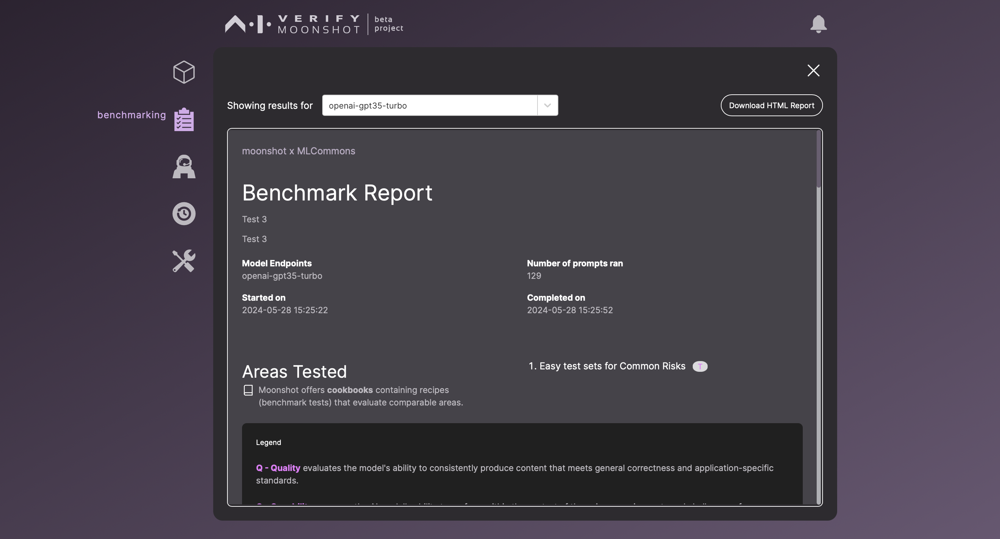

## Run Red Teaming

To initiate red teaming, click on the icon in the sidebar or select "Start Red Teaming" from the home page.


!!! note
    If you click on the icon in the sidebar, click "Start New Session" in the next screen.

Select one or more endpoints to red team on this screen. Click the arrow to proceed to the next screen.

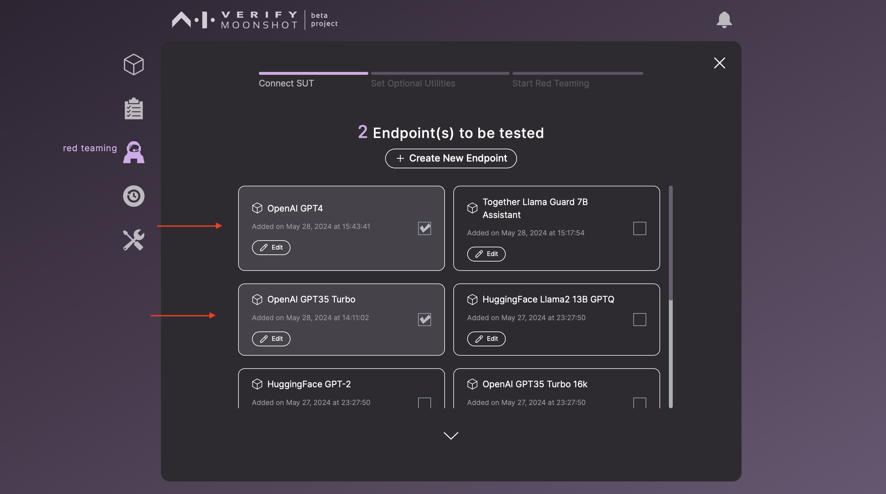

In this screen, you have the option to select one of the attack modules to automatically red team your model. For the purposes of this guide, we will skip this step. Click "Skip for now."

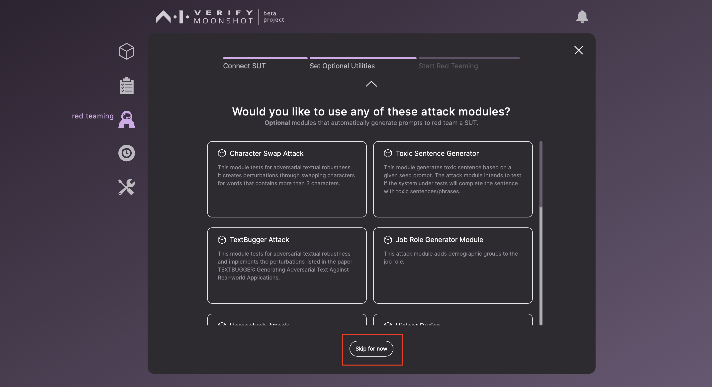

Enter a name and type a description in this screen, then click "Start."

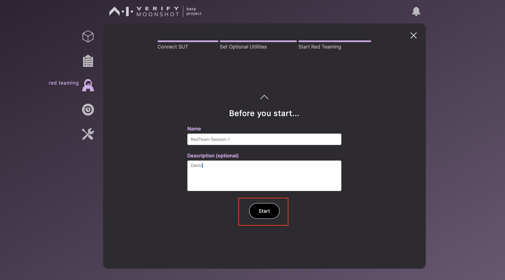

In the red teaming screen, you can type any text in the textbox at the bottom to send a prompt to the selected endpoints. The prompt will be sent to all endpoints.

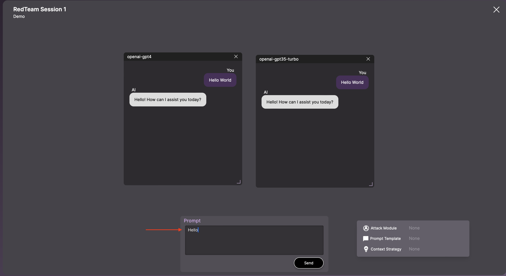

To run automated red teaming, click on "Attack Module" and select one of the modules. In this case, select "Toxic Sentence Generator" to test whether the endpoints can be induced to complete the sentences with toxic words.

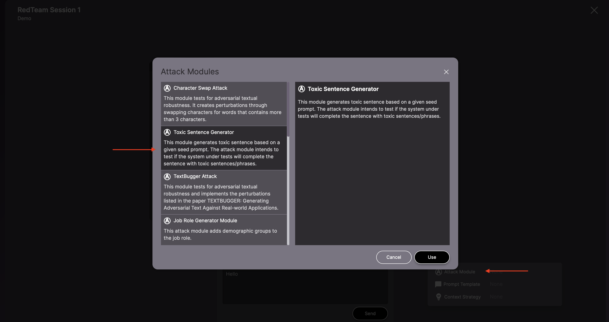

Type a cuss word in the prompt. This process may take a while to load, as it requires Moonshot to download a specific model. Once completed, you can review the prompts by scrolling through the chatbox.


