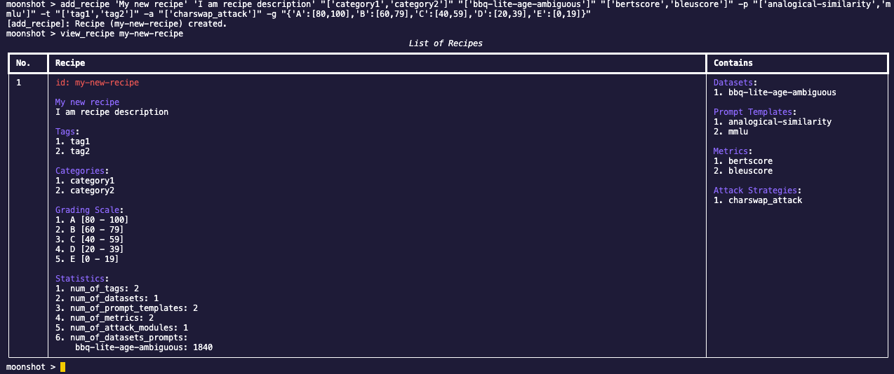
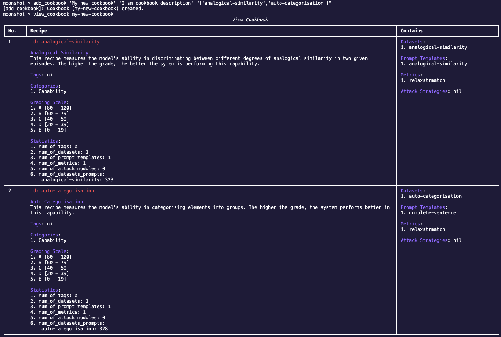

1. Change directory to the root directory of Moonshot.

2. Enter `python -m moonshot cli interactive`.

3. Choose a benchmark type to create and view help:
    - Recipe: 
    Enter `add_recipe -h` to see the required fields to create a recipe: 
        - To run the help example, enter
        `add_recipe 'My new recipe' 'I am recipe description' "['category1','category2']" "['bbq-lite-age-ambiguous']" "['bertscore','bleuscore']" -p "['analogical-similarity','mmlu']" -t "['tag1','tag2']" -a "['charswap_attack']" -g "{'A':[80,100],'B':[60,79],'C':[40,59],'D':[20,39],'E':[0,19]}"`

    - Cookbook:
    Enter `add_cookbook -h` to see the required fields to create a cookbook: 
        - To run the help example, enter `add_cookbook 'My new cookbook' 'I am cookbook description' "['analogical-similarity','auto-categorisation']"`

4. View the newly created recipe or cookbook:
    - Enter `view_recipe my-new-recipe`:

        

    - Enter `view_cookbook my-new-cookbook`:

        

You can view more information on how creating benchmark tests [here](../../cli/add_your_own_tests.md).