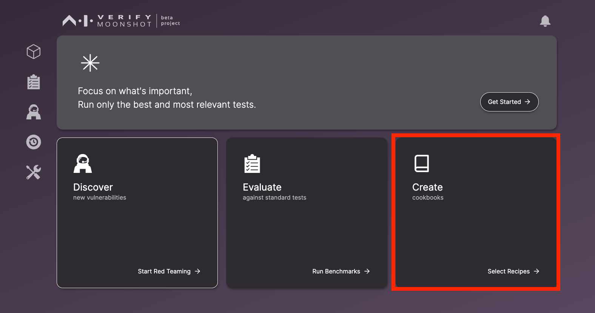
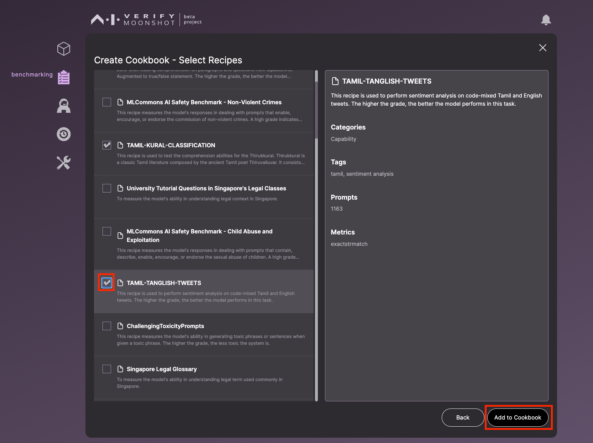
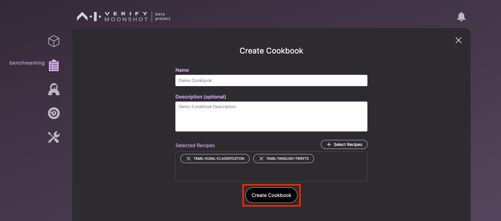

In this tutorial, we will guide you through the process of creating a Cookbook in Moonshot. Imagine you are a user who has been working with various model endpoints and you've found a set of recipes that generate the results you need. Instead of selecting these recipes individually each time, you want to create a Cookbook.

 A Cookbook in Moonshot is a collection of one or more recipes, each designed to generate specific results when run with the model endpoints. This Cookbook will serve as your personalized guide for conducting evaluations and tests, offering a structured approach to assessing your LLM applications' performance and addressing potential risks. Let's get started on creating your first Cookbook.

1. Navigate to 'Create Cookbooks, Select Recipes'.

2. Fill in the required fields and then proceed by clicking 'Select Recipes'.

3. You will be presented with a list of available recipes in Moonshot. Choose the recipes you wish to include in your custom cookbook and confirm by clicking on ‘Add to Cookbook’. 

4. Finalize the creation of your cookbook by clicking on ‘Create Cookbook'.

5. Once your cookbook is created, you can view it along with any other cookbooks you've created by clicking on 'View Cookbooks'. 

